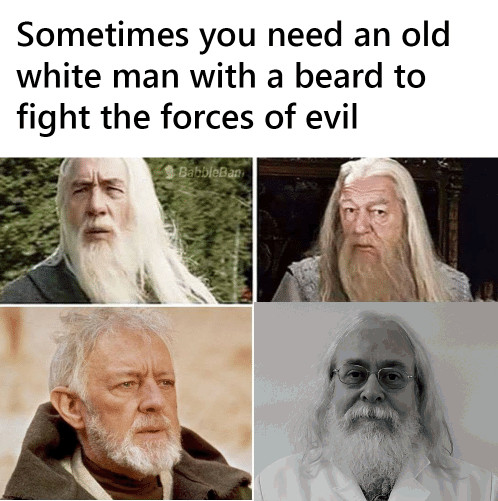

## EDF 5484 Educational Data Analysis

::: center
Introduction and Welcome
:::

## Who am I?

{width="75%," height="75%"} Russell Almond

## Contact info

-   <http://ralmond.net/>
-   Email: [ralmond\@fsu.edu](mailto:ralmond@fsu.edu){.email}
-   Office Hours, By appointment (appointment link: <https://doodle.com/mm/russellalmond/book-a-time>)
-   <https://fsu.zoom.us/my/ralmond>
-   On Campus, TTH Afternoons
-   STB 3204-J
-   Has ADHD

Questions welcome during lectures (speak up if on Zoom)

## Office Hours

-   I'm replacing the formal "office hours" with a "coffee hour" and "tea time" after my classes.
    -   Coffee Hour: T,Th 11:30 in my Zoom Room <https://fsu.zoom.us/my/ralmond>)
    -   Tea Time: W,F in my office 3204-J
-   Feel free to drop by with technical questions, or just to chat
-   Zoom and office door open (although I may be in kitchen or 3204 common area).
-   Appointment link: <https://doodle.com/mm/russellalmond/book-a-time>

## Course Text

**Required:**

-   Gelman, A., Hill, J. & Vehtari, A. (2022) *Regression and Other Stories*. Cambridge University Press.

-   Vehtari's course page: <https://avehtari.github.io/ROS-Examples/>

    -   R code for book examples
    -   Data for homework problems.
    -   PDF of book

**Additional Readings:**

-   Andy Gelman's Blog: <http://andrewgelman.com/>

## Posit Cloud

## Software

Will do most work through Posit Studio:

<https://posit.cloud/spaces/323676/join?access_code=-cWB4jXG0_PEIPItmrQWUzfsYsW4GZhTToU-Ork0>

Free Student Account.

## Concepts Covered (1)

-   Identify situations in which a particular generalized linear model is appropriate to answer a given research question with a given data set.

-   Perform common data analyses operations with generalized linear models in the R programming language.

-   Interpret the results of generalized linear models in terms of the original research questions

-   Construct graphical displays (figures and tables) which summarize the results of a data analysis.

## Concepts Covered (2)

-   Identify situations in which transforming the variables in the data set before analysis is appropriate.

-   Interpret the results of analyses with transformed variables.

-   Employ common diagnostic statistics and plots to identify and correct difficulties with (generalized) linear models.

-   Simulate data from a (generalized) linear model.

-   Produce statistical graphics to explain key results of generalized linear models.

-   Write up the results of statistical analyses in a form suitable for the results section of a scientific journal article.

## Flipping The Class

-   With a few exception, I will not lecture

-   Lecture notes posted in the class are for reference: I may or may not spontaneously talk about them.

-   Before each class, one of the chapters of Gelman, Hill & Vehtari will be assigned for reading.

-   Students will take turns working the homework problems in class. (*Case Studies*)

## Evidence Mix

-   Case Studies (1/2) -- Need to be able to get the discussion going, not necessarily finish the problem.

-   Midterm Project (1/4)

-   Final Project (1/4)

*Evidence turned in after May 1st will not be considered unless there are extenuating circumstances (i.e., you are getting an incomplete)*

## Case Studies (1/2)

-   Serves dual purpose:
    -   Forces you to verbalize your ideas about statistics, this promotes readiness-to-learn
    -   Provides me with formative feedback
-   NOT graded on correctness
-   You are assigned problem (from book or Posit Cloud).
-   Prepare solution
    -   or partial solution if you get stuck
-   Present as much as you completed in class
    -   Class will help you complete
-   Currently 8 are scheduled, but could be more/less depending on schedule.

## Case Study Procedures

-   There will be a Canvas discussion forum for posting Case Study solutions (so you can access them easily from class).
-   Must be present on day of completion
-   We will try to scheduled approximately when they are due when assigned
    -   Let me know about planned travel, other commitments.
    -   In case of excused absence will try to reschedule

## Midterm/Final Project (1/4 each)

-   Find a data set and a research question.

-   (about 6 weeks before final due date) Get data set and research question approved.

-   Analyze data (however you feel appropriate)

-   (2 weeks before final due date): Turn in draft for feedback

-   (1 week before final due date): Feedback returned

*Final paper due.*

## Project Scoring Rubric

| Criterion                                                         | Points |
|--------------------------------------------------------------|----------|
| Research question properly stated and motivated                   | 10     |
| Data sufficiently described                                       | 10     |
| Analysis Research question properly stated and motivated          | 10     |
| Data sufficiently described                                       | 10     |
| Analysis method appropriate for research question and data        | 10     |
| Analysis correctly carried out                                    | 10     |
| Graphics and tables included to support analysis                  | 10     |
| Diagnostic analyses carried out to check appropriateness of model | 10     |
| Results of analysis properly interpreted and summarized           | 10     |
| Limitations of analysis recognized                                | 10     |
| Document text follows style/usage conventions for academic papers | 10     |

## Style Points

-   Commenting Code

-   Using descriptive variable and function names

-   Formatting code properly (indentation to show program structure, white space, using `<-` for assignments)

-   Using human readable label in plots and tables

-   Editing out dead-end code

-   Including information about data sources and meta-data.

-   Documenting function inputs, outputs and side-effects.

-   Properly parameterizing expressions (i.e., avoiding hard coded constants).

## Project Schedule

(On Canvas)
Midterm paper due just before spring break.
Final paper due at the end of finals week.

## Collaborations

-   Case Studies
    -   Larger case studies can be assigned as a team
    -   Use Blackboard discussion groups for help
-   Projects
    -   Collaboration is possible but must be approved in advance
    -   Each team member provides a unique piece

## Plagiarism

-   Plagiarism is a serious problem
    -   People have LOST THEIR DEGREES
    -   First time violations will be reported
    -   See FSU policies and resources
    -   Turn-it-in used for projects
    -   Credit your sources!

## FSU Teaching

-   Don't use forums, FSU emails &c for personal purposes
    -   All FSU emails are public record
    -   *Must* use FSU email for grade-related requests
-   *Don't use FSU Resources to download copyrighted material not related to your class work or research!*
-   Beware of leaving Bit Torrent clients on while connected to FSU network

## How's My Teaching?

Dial: ~~644-5203~~

Email: [ralmond\@fsu.edu](mailto:ralmond@fsu.edu)

Let me know if you have problems reading material, especially if you have trouble distinguishing red from black.

## Turning the ~~Battleship~~ Destroyer

👍 (Thumbs up) I get it already, you can skip ahead

👎 (Thumbs down) I'm confused, give me more detail

👏 (Hand up) Stop, I have a question (or issue)

What to do if you are lost

-   Confusion is a part of learning
    -   But it should be temporary
-   Ask questions in class!
-   Come visit during office hours, or make an appointment
-   Be specific about what is confusing you
